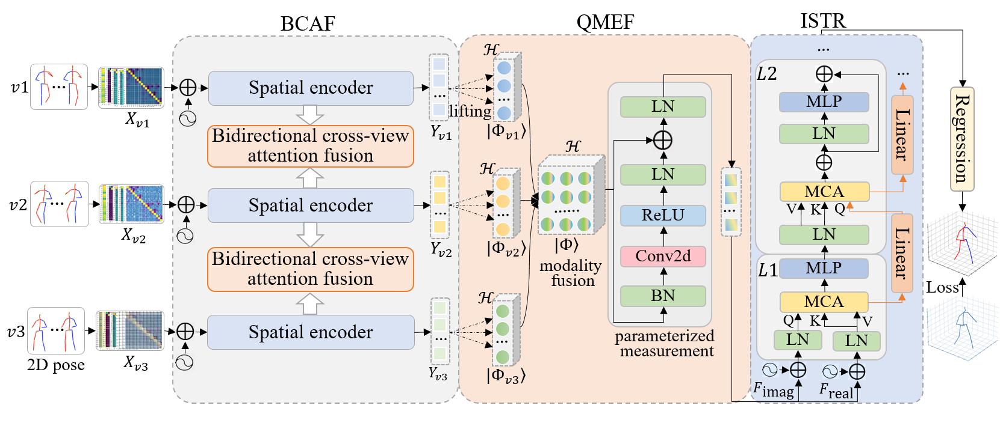

# HMVformer-plus-plus
This is the official repository of our PR paper "HMVformer++: Hierarchical multi-view fusion transformer for efficient 3D human pose estimation"

<p align="center"></p>

## Installation

- Create a conda environment: ```conda create -n hmvformer python=3.7```
- Download cudatoolkit=11.0 from [here](https://developer.nvidia.com/cuda-11.0-download-archive) and install 
- ```pip3 install torch==1.7.1+cu110 torchvision==0.8.2+cu110 -f https://download.pytorch.org/whl/torch_stable.html```
- ```pip3 install -r requirements.txt```

## Dataset Setup

Please download the dataset from [Human3.6M](http://vision.imar.ro/human3.6m/) website and refer to [VideoPose3D](https://github.com/facebookresearch/VideoPose3D) to set up the Human3.6M dataset ('./dataset' directory). 
Or you can download the processed data from [here](https://drive.google.com/drive/folders/1F_qbuZTwLJGUSib1oBUTYfOrLB6-MKrM?usp=sharing). 

```bash
${POSE_ROOT}/
|-- dataset
|   |-- data_3d_h36m.npz
|   |-- data_2d_h36m_gt.npz
|   |-- data_2d_h36m_cpn_ft_h36m_dbb.npz
```

## Download Pretrained Model

The pretrained model can be found in the './checkpoint/pretrained' directory. 

## Test the Model

To test on a pretrained model on Human3.6M:

```bash
python main.py --test --previous_dir './checkpoint/pretrained/pretrained.pth'
```

## Train the Model
To train a model on Human3.6M:

```bash
python main.py --frames 27 --batch_size 1024 --nepoch 50 --lr 0.0002 
```

## The pretrained model
Please download the pre-trained model from the link below. The model path in the `main` function is `./checkpoint/pretrained/`, which you may modify as needed.

UTL：https://pan.baidu.com/s/1rCf7YrqB6R0HPrxF1ohQzQ?pwd=n45t 

## Citation
If you find our work useful in your research, please consider citing:

@article{zhang2026hmvformer++,
title = {HMVformer++: Hierarchical Multi-view Fusion Transformer for Efficient 3D Human Pose Estimation},
author = {Zhang, Lijun and Zhou, Kangkang and Lu, Feng and Wang, Yan and Lan, Xiangyuan and Zhou, Xiang-Dong and Shi, Yu},
journal = {Pattern Recognition},
pages = {113305},
year = {2026},
}

## Acknowledgement

We thank the authors for releasing the codes. 

- [PoseFormer](https://github.com/zczcwh/PoseFormer)
- [VideoPose3D](https://github.com/facebookresearch/VideoPose3D)
